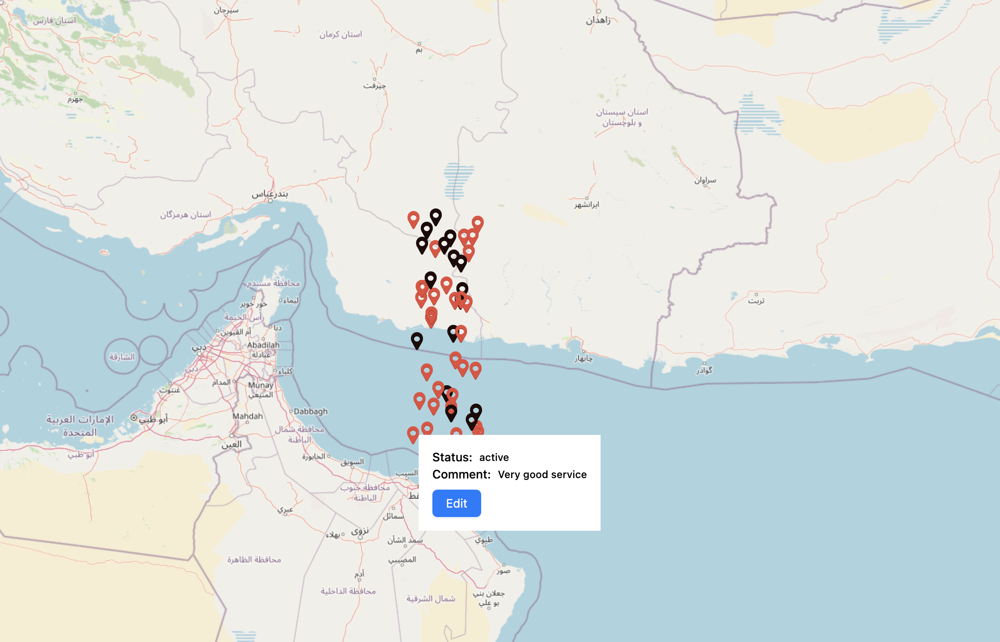
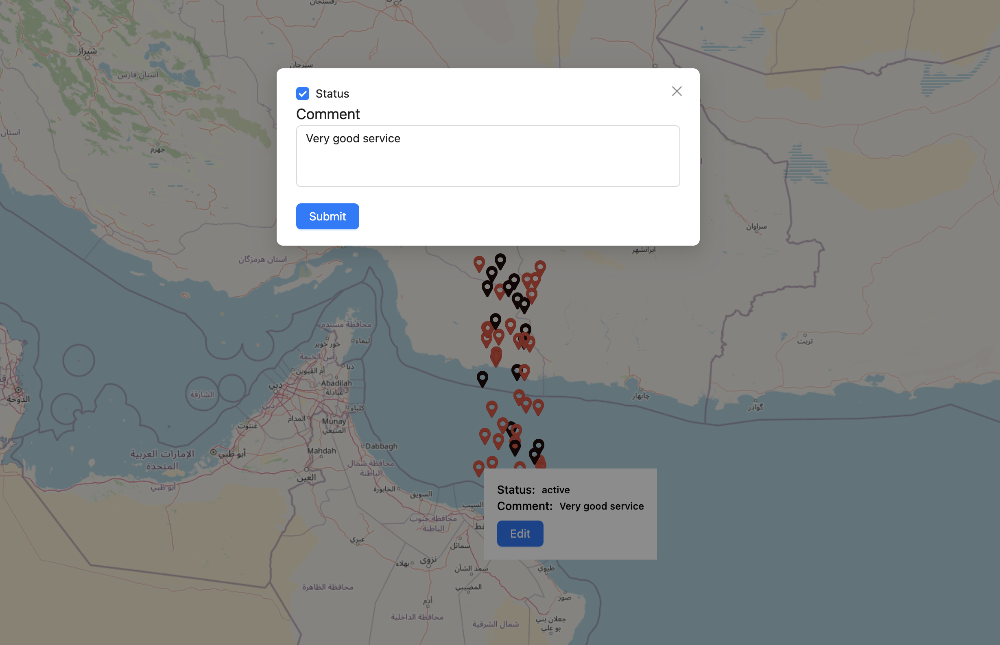
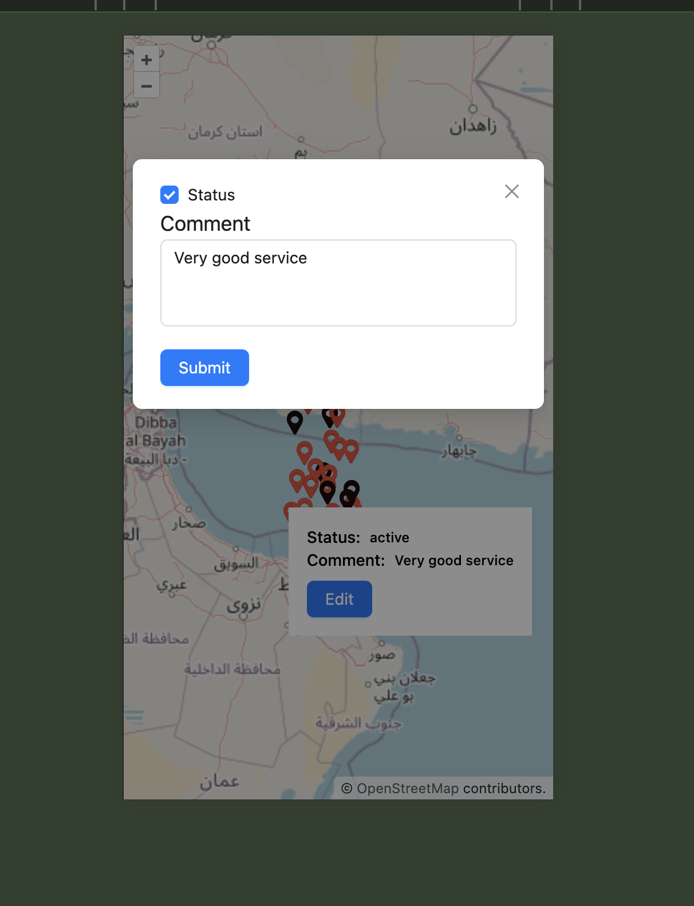

# OpenLayers Map Project

This project demonstrates how to integrate OpenLayers with React to create an interactive map with custom markers and popups. The map allows users to click on markers to view more details and edit information in a modal. Key features include:

- Interactive map with clickable markers
- Custom popup for displaying marker information
- Ability to edit and update marker details in a modal
- State management for handling marker data
- Handling offline data after first load

## Features

- **Marker Interaction:** Click on a marker to view and edit its details.
- **Popup System:** Displays status and comments of the selected marker.
- **Edit Modal:** Allows users to update marker details.

## Technologies Used

- **React.js** for the frontend
- **OpenLayers** for map rendering
- **Ant Design** for UI components

## Screenshots

### Fullscreen mode

### Popup

### Edit mode

### Mobile view

